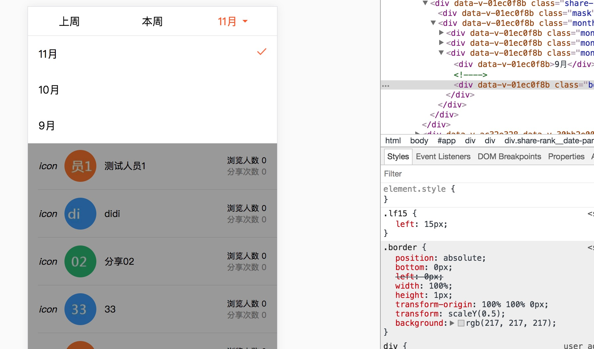
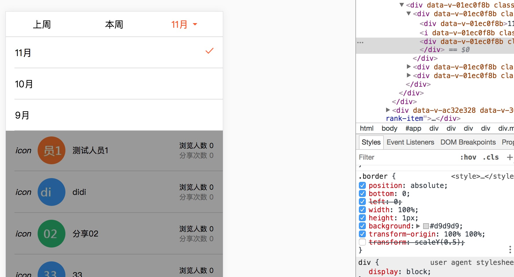

## 使用1px遇到的问题






```
 .border {
    position: absolute;
    bottom: 0;
    left: 0;
    width: 100%;
    height: 1px;
    background: #d9d9d9;
    transform-origin: 100% 100%;
    transform: scaleY(0.5);
}
```
以上css在绝大多数的情况下都能非常完美的执行，模拟一个1px的border,但是将整个元素放在vue的transition动画里，border会消失。出现如上图显示的bug


```
    //   animation
    @keyframes slideDown {
        from {
            transform: translate3d(0, -100%, 0);
            visibility: visible;
            // opacity: 0;
    }

    to {
        transform: translate3d(0, 0, 0);
        // opacity: 1;
    }
    }
    .slideDown-enter-active {
        animation: slideDown .5s;
    }
    .slideDown-leave-active {
        animation: slideDown .5s reverse;
    }
```

## 原因


## 解决方案

```
 .border {
    position: absolute;
    bottom: 0;
    left: 0;
    width: 100%;
    height: 1px;
    background: #d9d9d9;
    transform-origin: 100% 100%;
    //这行0.5 -> 0.6就好了。。。。。
    transform: scaleY(0.6);
}
```
